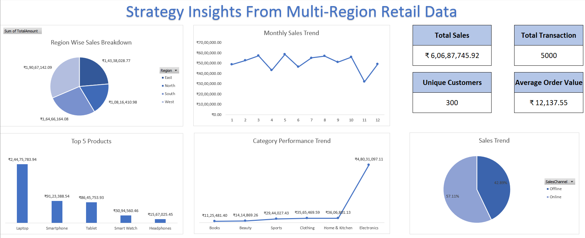
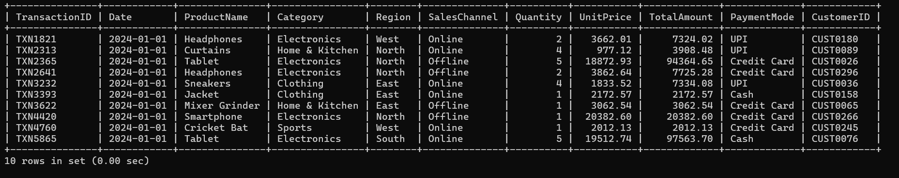
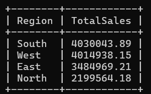
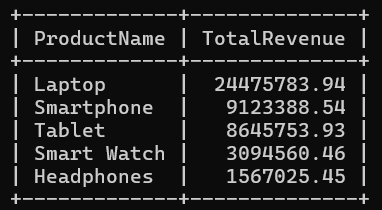
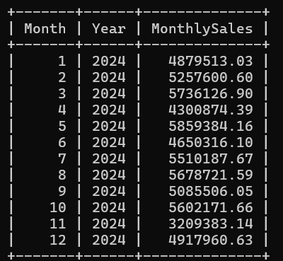
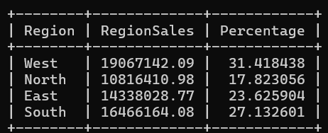
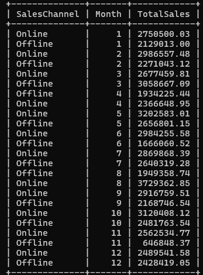
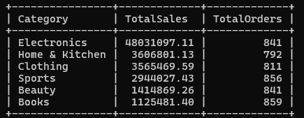

# 🛒 Sales Uplift: Strategy Insights from Multi-Region Retail Data

<div align="center">


**A complete end-to-end retail data analysis project using MySQL + Excel — uncovering revenue patterns, customer behaviour, and regional performance across 5,000 transactions.**

</div>

---

## 📊 Dashboard Preview

<div align="center">



*Interactive Excel Dashboard — Region Breakdown · Monthly Trend · Top Products · Category Performance · Sales Channel Split*

</div>

---

## 🚀 Project Overview

This project simulates a real-world **business case study** for a multi-region retail company. Using raw transactional data, I performed structured SQL queries to extract meaningful insights, then visualised them in an Excel dashboard to support strategic decision-making.

> 📌 **Goal:** Help business stakeholders understand *where sales are strong, where they're weak, and what to do next.*

---

## 📁 Project Structure

```
📦 Sales-Uplift-Multi-Region-Retail
 ┣ 📄 RetailTransactions.xlsx       ← Raw dataset (5,000 rows)
 ┣ 📄 retailanalysis.sql            ← All SQL queries used
 ┣ 📄 insights.txt                  ← Key business insights
 ┣ 📊 Excel Dashboard               ← Visual dashboard
 ┗ 📸 screenshots/
    ┣ 01_database_preview.png
    ┣ 02_region_sales_last_quarter.png
    ┣ 03_top5_products_revenue.png
    ┣ 04_monthly_sales_trend.png
    ┣ 05_region_contribution_percentage.png
    ┣ 06_online_vs_offline_monthly.png
    ┣ 07_category_performance.png
    ┗ 08_excel_dashboard.png
```

---

## 🗃️ Dataset Schema

| Column | Type | Description |
|---|---|---|
| `TransactionID` | VARCHAR | Unique transaction identifier |
| `Date` | DATE | Transaction date |
| `ProductName` | VARCHAR | Name of the product sold |
| `Category` | VARCHAR | Product category |
| `Region` | VARCHAR | Sales region (North/South/East/West) |
| `SalesChannel` | VARCHAR | Online or Offline |
| `Quantity` | INT | Units sold |
| `UnitPrice` | DECIMAL | Price per unit |
| `TotalAmount` | DECIMAL | Revenue from transaction |
| `PaymentMode` | VARCHAR | UPI / Credit Card / Cash |
| `CustomerID` | VARCHAR | Unique customer reference |

---

## 🔄 Project Workflow

```
┌─────────────────────────────────────────────────────────┐
│                    PROJECT PIPELINE                      │
└─────────────────────────────────────────────────────────┘

  📥 RAW DATA          🛠️ DATA MODELLING       📊 ANALYSIS
  ┌──────────┐         ┌──────────────┐        ┌──────────────┐
  │ Retail   │  ──▶    │  MySQL DB    │  ──▶   │  SQL Queries │
  │ XLSX File│         │  RetailDB    │        │  (7 queries) │
  └──────────┘         └──────────────┘        └──────┬───────┘
                                                       │
                                                       ▼
  💡 INSIGHTS          📈 VISUALISATION        📤 RESULTS
  ┌──────────┐         ┌──────────────┐        ┌──────────────┐
  │ Business │  ◀──    │  Excel       │  ◀──   │  Query       │
  │ Strategy │         │  Dashboard   │        │  Outputs     │
  └──────────┘         └──────────────┘        └──────────────┘
```

---

## 🗄️ SQL Analysis — Query by Query

### 1️⃣ Database Preview

```sql
SELECT * FROM RetailTransactions LIMIT 10;
```



---

### 2️⃣ Regional Sales — Last Quarter (Q4 2024)

```sql
SELECT Region, SUM(TotalAmount) AS TotalSales FROM RetailTransactions
WHERE Date BETWEEN '2024-10-01' AND '2024-12-31'
GROUP BY Region ORDER BY TotalSales DESC;
```



> 🏆 **South** led Q4 with ₹40.3L, while **North** trailed at ₹21.9L.

---

### 3️⃣ Top 5 Best-Selling Products by Revenue

```sql
SELECT ProductName, SUM(TotalAmount) AS TotalRevenue FROM RetailTransactions
GROUP BY ProductName ORDER BY TotalRevenue DESC LIMIT 5;
```



> 💻 **Laptop** dominates with ₹2.44 Cr — more than 2x the second-best seller.

---

### 4️⃣ Monthly Sales Trend

```sql
SELECT MONTH(Date) AS Month, YEAR(Date) AS Year, SUM(TotalAmount) AS MonthlySales
FROM RetailTransactions GROUP BY YEAR(Date), MONTH(Date) ORDER BY Year, Month;
```



> 📉 Notable dip in **November** (₹32L) — a key opportunity for seasonal campaigns.

---

### 5️⃣ Region-Wise Contribution to Total Sales

```sql
SELECT Region, SUM(TotalAmount) AS RegionSales,
SUM(TotalAmount) * 100 / (SELECT SUM(TotalAmount) FROM RetailTransactions) AS Percentage
FROM RetailTransactions GROUP BY Region;
```



> 🗺️ **West** contributes the most at 31.4%, **North** the least at 17.8%.

---

### 6️⃣ Online vs Offline Sales — Monthly Comparison

```sql
SELECT SalesChannel, MONTH(Date) AS Month, SUM(TotalAmount) AS TotalSales
FROM RetailTransactions GROUP BY SalesChannel, MONTH(Date) ORDER BY Month;
```



> 🌐 **Online consistently outperforms Offline** across most months of the year.

---

### 7️⃣ Category Performance

```sql
SELECT Category, SUM(TotalAmount) AS TotalSales, COUNT(*) AS TotalOrders
FROM RetailTransactions GROUP BY Category ORDER BY TotalSales DESC;
```



> ⚡ **Electronics** leads all categories by a massive margin — 4x higher than Books.

---

## 💡 Key Business Insights

| # | Question | Answer |
|---|---|---|
| 👤 | **Most Valuable Customers?** | CUST0004 (89 purchases) & CUST0055 (88 purchases) |
| 📦 | **Products to focus on next quarter?** | Laptop, Smartphone, Tablet, Smart Watch, Headphones |
| 🌐 | **Online vs Offline?** | Online leads at **57.11%** vs Offline 42.89% |
| 🗺️ | **Region needing marketing support?** | **North** — lowest sales at ₹1,08,16,410.98 |
| ⚡ | **Highest revenue category?** | **Electronics** at ₹4,80,31,097.11 |
| 💰 | **Overall business performance?** | ₹6,06,87,745.92 total across 5,000 transactions |
| 🧾 | **Average order value?** | ₹12,137.55 per transaction |

---

## 📈 KPI Summary

<div align="center">

| 💰 Total Sales | 🧾 Total Transactions | 👥 Unique Customers | 📦 Avg Order Value |
|:---:|:---:|:---:|:---:|
| **₹6,06,87,745.92** | **5,000** | **300** | **₹12,137.55** |

</div>

---

## 🛠️ Tools & Technologies

| Tool | Purpose |
|---|---|
| 🐬 **MySQL** | Database creation, data import & SQL querying |
| 📊 **Microsoft Excel** | Pivot tables, charts & interactive dashboard |
| 📝 **XLSX** | Raw dataset format |
| 💻 **Git & GitHub** | Version control & project hosting |

---

## 🧠 Skills Demonstrated

- ✅ Database design & schema creation in MySQL
- ✅ Writing complex SQL queries (GROUP BY, HAVING, subqueries, date filtering)
- ✅ Aggregation & window-style analysis
- ✅ Business KPI extraction from raw transactional data
- ✅ Data storytelling via Excel dashboards
- ✅ Actionable insight generation for non-technical stakeholders

---

## 🚀 How to Run This Project

```bash
# 1. Clone the repository
git clone https://github.com/HarshalVora86/Sales-Uplift-Strategy-Insights-from-Multi-Region-Retail-Data.git

# 2. Import dataset into MySQL
mysql -u root -p RetailDB < retailanalysis.sql

# 3. Load the XLSX into the RetailTransactions table
# Open RetailTransactions.xlsx in Excel, export as CSV, then:
LOAD DATA INFILE 'RetailTransactions.csv'
INTO TABLE RetailTransactions
FIELDS TERMINATED BY ','
IGNORE 1 ROWS;

# 4. Run any query from retailanalysis.sql to explore!
```

---

## 🎥 Project Overview

https://raw.githubusercontent.com/HarshalVora86/Sales-Uplift-Strategy-Insights-from-Multi-Region-Retail-Data/main/assets/project-overview.mp4

## 👨‍💻 Author

<div align="center">

**Harshal Vora**

[](https://github.com/HarshalVora86)

*Data Analyst | SQL | Excel | Power BI*

⭐ *If you found this project useful, consider giving it a star!* ⭐

</div>

---

<div align="center">
<sub>Built with 💙 as part of a Business Case Study Portfolio Project</sub>
</div>
